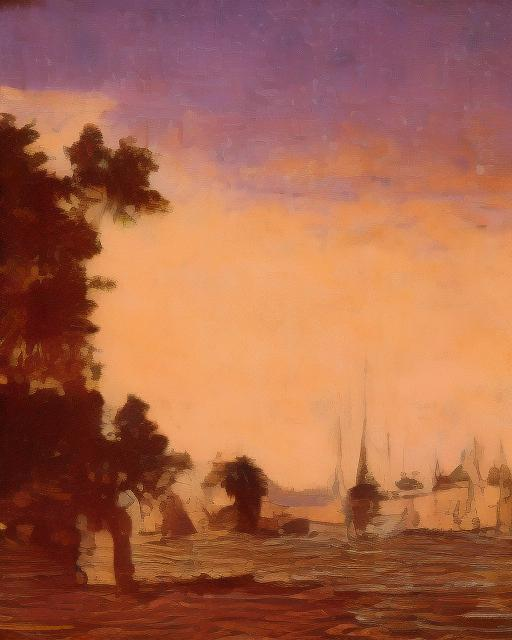
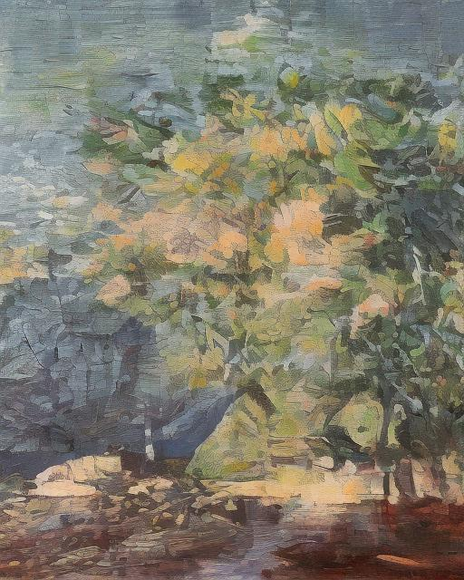
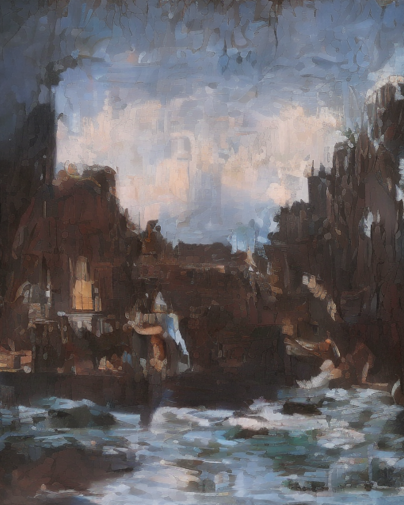
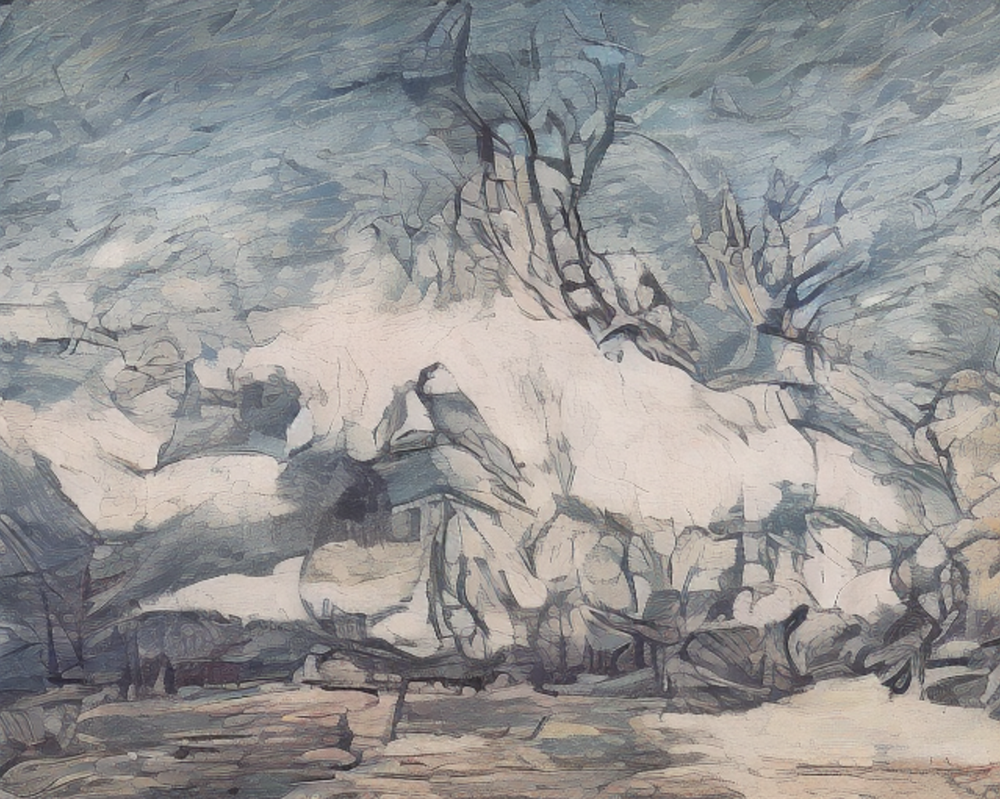
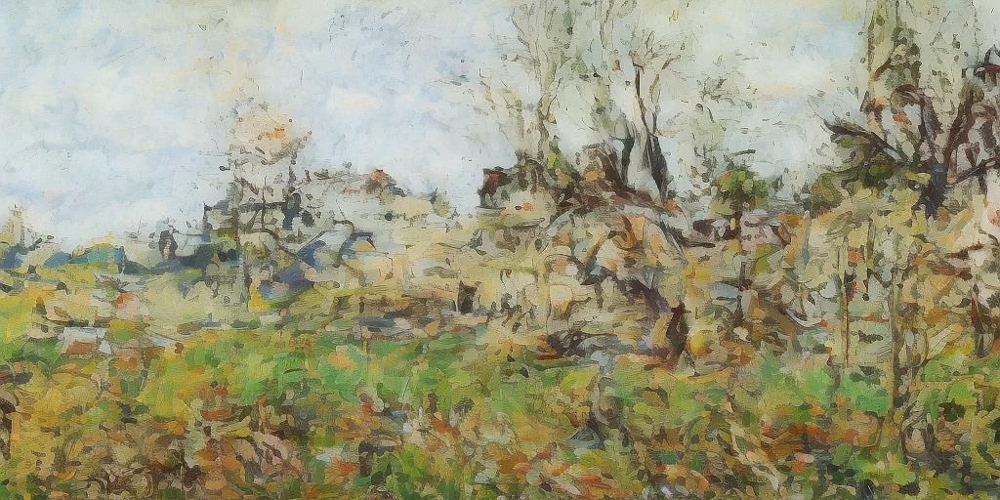
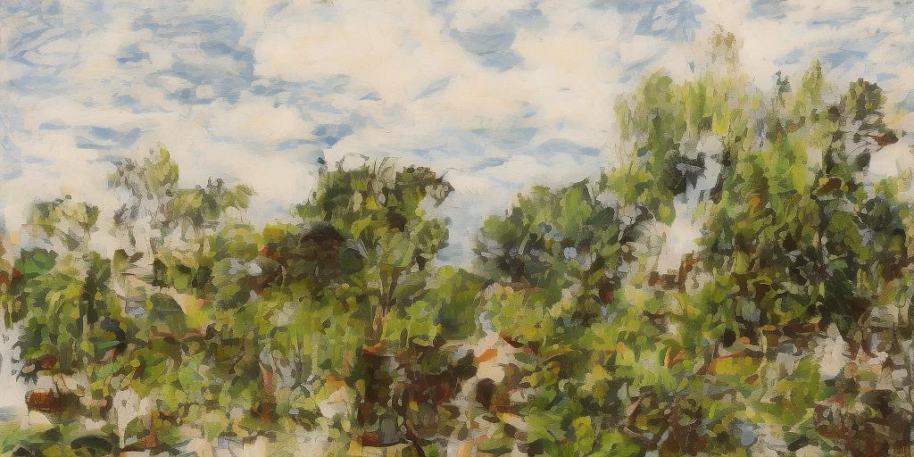
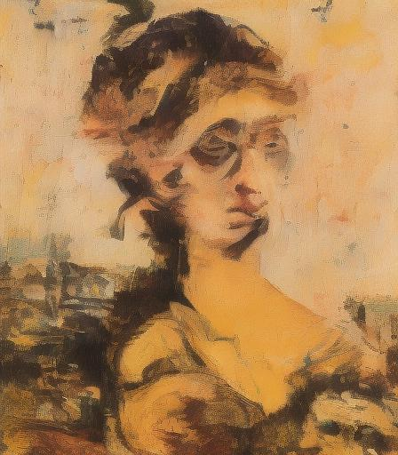

# WikiArt-Latent-Diffusion
Conditional denoising diffusion probabilistic model trained in latent space to generate paintings by famous artists. See the animation of the latent diffusion process in the figure below.

  
   
    <em>Fig. 1. The animation of the latent diffusion process.</em>

### Generalization to Different Sizes
The model is able to generale to different image sizes. See generated examples below.

  
   
    <em>Fig. 2. Generated painting in the style of Ivan Aivazovsky.</em>

  
   
    <em>Fig. 3. Generated painting in the style of Ivan Aivazovsky.</em>

  
   
    <em>Fig. 4. Generated painting in the style of Ivan Aivazovsky.</em>

  
   
    <em>Fig. 5. Generated painting in the style of Martiros Saryan.</em>

  
   
    <em>Fig. 6. Generated painting in the style of Camille Pissarro.</em>

  
   
    <em>Fig. 7. Generated painting in the style of Pyotr Konchalovsky.</em>

  
   
    <em>Fig. 8. Generated painting in the style of Pierre Auguste Renoir.</em>

### Repository structure:
- **[config.py](https://github.com/artem-gorodetskii/WikiArt-Latent-Diffusion/blob/master/config.py)** is a file with model hyperparameters.
- **[dataset.py](https://github.com/artem-gorodetskii/WikiArt-Latent-Diffusion/blob/master/dataset.py)** contains dataset class.
- **[generate_features.py](https://github.com/artem-gorodetskii/WikiArt-Latent-Diffusion/blob/master/generate_features.py)** contains functions to prepare dataset.
- **[models.py](https://github.com/artem-gorodetskii/WikiArt-Latent-Diffusion/blob/master/model.py)** contains implementations of the latent UNet model.
- **[pipeline.py](https://github.com/artem-gorodetskii/WikiArt-Latent-Diffusion/blob/master/pipeline.py)** is a latent diffusion pipeline.
- **[train.py](https://github.com/artem-gorodetskii/WikiArt-Latent-Diffusion/blob/master/train.py)** performs training of the LatentUNet model using a single GPU instance.
- **[evaluate.py](https://github.com/artem-gorodetskii/WikiArt-Latent-Diffusion/blob/master/evaluate.py)** performs evaluation of trained pipeline.
- the notebook **[inference_example](https://github.com/artem-gorodetskii/WikiArt-Latent-Diffusion/blob/master/inference_example.ipynb)** includes inference examples of the developed pieline.

### Dataset
We used the [WikiArt](https://huggingface.co/datasets/huggan/wikiart) dataset containing 81444 pieces of visual art from various artists. All images were cropped and resized to 512x512 resolution. To convert images into latent representation we apply the pretrained [VQ-VAE](https://arxiv.org/abs/1711.00937) from the [Stable Diffusion model](https://arxiv.org/abs/2112.10752) implemented by [StabilityAI](https://stability.ai/).

### Diffusion Model
We adapted 2D UNet model from Hugging Face [diffusers package](https://github.com/huggingface/diffusers) by adding three additional embedding layers to control paining style, including artist name, genre name and style name. Before adding the style embedding to time embedding, we pass each type of style embedding through [PreNet](https://github.com/artem-gorodetskii/WikiArt-Latent-Diffusion/blob/5d37b3cc886aec9cfb077e4cb04cd3e7afaa536f/model.py#L14) modules. 

The network is trained to predict the unscaled noise component using Huber loss function (it produces better results on this dataset compared to L2 loss). During evaluation, the generated latent representations are decoded into images using the pretrained [VQ-VAE](https://arxiv.org/abs/1711.00937).

